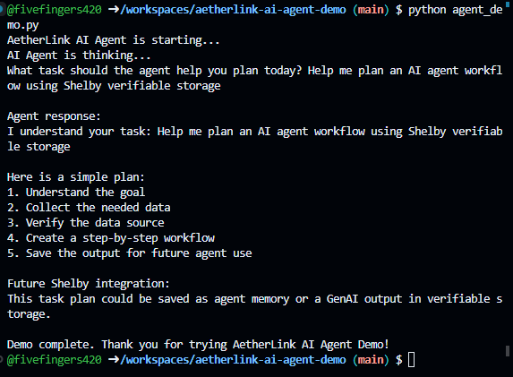

# AetherLink AI Agent Demo


## Simple AI agent demo for decentralized orchestration using verifiable storage

**AetherLink AI Agent Demo** is a beginner-friendly demo project that shows how AI agents can plan tasks, coordinate workflows, and prepare for a future where agent data is stored in a verifiable decentralized storage layer.

This project is designed as a simple builder demo for exploring AI agent orchestration, cross-chain collaboration, provenance, and future integration with Shelby verifiable global object storage.

The current version is intentionally simple. It does not call a real AI model yet. Instead, it simulates the basic flow of an AI agent:

1. The agent starts.
2. The user gives it a task.
3. The agent thinks through the request.
4. The agent creates a simple action plan.
5. Future versions can store agent memory, generated outputs, and workflow history using Shelby.

---

## Project goal

The goal of this repository is to demonstrate a basic foundation for a decentralized AI agent orchestration platform that will eventually use **Shelby (@shelbyserves)** verifiable global object storage for real-time data access in AI agent workflows.

AetherLink is built around one simple idea:

> AI agents should not depend only on private, closed, or fragile data systems.  
> They need reliable storage, clear provenance, and fast access to shared data across different workflows and networks.

In the future, this demo can evolve into a system where agents can:

- Share task memory across workflows
- Store generated AI outputs
- Access real-time data from verifiable storage
- Track where data came from
- Coordinate securely across chains
- Reduce unnecessary data movement and egress costs
- Build trust through provenance and verifiable records

---

## Why AI agents need better data infrastructure

AI agents are only as useful as the data they can access.

Today, many agent systems still rely on traditional storage setups where data can be:

- Siloed inside one platform
- Expensive to retrieve repeatedly
- Hard to verify
- Difficult to share across applications
- Missing clear provenance
- Risky for multi-agent or cross-chain workflows

This becomes a bigger issue when multiple AI agents need to work together.

For example:

- A research agent may collect data.
- A planning agent may turn that data into tasks.
- A finance agent may check risks.
- A publishing agent may create final output.
- A verification agent may need to prove where the data came from.

Without a reliable shared storage layer, every agent may create its own copy of the same data. This can increase cost, reduce trust, and make workflows harder to audit.

AetherLink is a small demo of how this problem can be solved over time.

---

## How AetherLink helps

AetherLink is designed to become a lightweight orchestration layer for AI agents.

The idea is simple:

```text
User request
   ↓
AI agent receives task
   ↓
Agent creates a plan
   ↓
Agent stores memory and outputs
   ↓
Other agents can read trusted data
   ↓
Workflow continues across tools, chains, and applications
```

## Demo screenshot

This screenshot shows the first working version of AetherLink AI Agent Demo running successfully.



---

## License

This project is licensed under the MIT License.

**You are free to use, modify, and share this project.**


